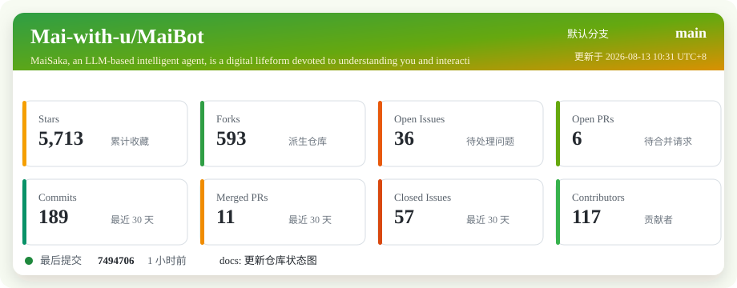
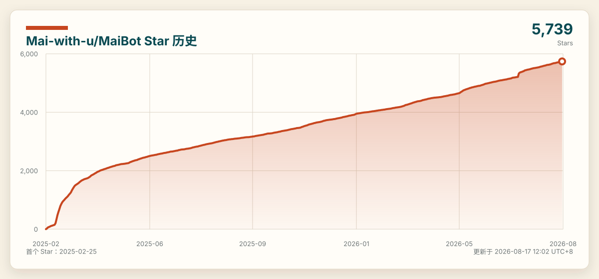

  <!-- Language Switcher -->
  <a href="../README.md">Bilingual</a> | <a href="README_CN.md">简体中文</a> | <a href="README_EN.md">English</a>

   

  <h1>MaiBot</h1>

  <!-- Badges Row -->
  

    
    
    
    
    
     
    
  

 

<!-- Mascot on the Right (Float) -->

## Introduction

MaiSaka is an interactive agent based on large language models.

MaiSaka is more than just a bot, and more than a "helpful assistant" that completes tasks. She is a digital life form that tries to understand you and interact in a genuinely human style. She does not pursue perfection or efficiency above all else. She pursues warmth and authenticity.

- 💭 **No one likes GPT-sounding dialogue**: MaiSaka uses a more natural conversational style. Instead of long-winded markdown-heavy replies, she chats in a way that feels casual, varied, and human.
- 🎭 **No longer stuck in rigid Q&A**: She knows when to speak, how to read the room, when to join a conversation, and when to stay quiet.
- 🧠 **MaiSaka becoming human**: In group conversations, MaiSaka imitates how people around her speak, learns new slang and in-group language, and keeps evolving.
- ❤️ **Always learning more about you**: Inspired by personality theory in psychology, MaiSaka gradually builds an understanding of your preferences, traits, habits, and behavior style.
- 🔌 **Plugin system**: Provides powerful APIs and an event system with virtually unlimited room for extension.

### Quick Navigation

  <a href="https://www.bilibili.com/video/BV1amAneGE3P">🌟 Demo Video</a> &nbsp;|&nbsp;
  <a href="#installation">📦 Quick Start</a> &nbsp;|&nbsp;
  <a href="#-documentation">📃 Core Documentation</a> &nbsp;|&nbsp;
  <a href="#-discussion-and-community">💬 Join Community</a>

<!-- Clear float to ensure subsequent content starts below the image area if text is short -->
 

   
  <a href="https://www.bilibili.com/video/BV1amAneGE3P" target="_blank">
    <picture>
      <source media="(max-width: 600px)" srcset="../depends-data/video.png" width="100%">
      
    </picture>
     
    <small>Watch the MaiSaka demo video</small>
  </a>

   
  

---

## Installation

**Latest Version: v1.2.0**

- **Download**: Visit the [Release](https://github.com/Mai-with-u/MaiBot/releases/) page to get the latest version.

- **[Deployment Guide](https://docs.mai-mai.org/manual/deployment/)**

- **Easy-to-use MaiBot launcher (Windows/macOS)**: [Maibot-OK](https://github.com/Mai-with-u/MaiBotOneKey/releases/)

| Branch | Description |
| :--- | :--- |
| `main` | **Stable** |
| `dev` | Development branch with features currently in development |

---

## 📚 Documentation

- **[📚 MaiBot Documentation](https://docs.mai-mai.org)**: The most comprehensive documentation hub for everything about MaiSaka.

---

## 💬 Discussion and Community

| Group | Description |
| :--- | :--- |
| MaiBrain EEG: 571780722 | Technical discussion / Q&A |
| MaiBrain MRI: 766798517 | Technical discussion / Q&A |
| [Mai Wants to Be a VTuber](https://qm.qq.com/q/wGePTl1UyY) | Technical discussion / Q&A |
| [Mai Casual Chat Group](https://qm.qq.com/q/JxvHZnxyec) | Casual chat only, no support |
| Plugin Dev Group: 1036092828 | Advanced development and testing |

---

## 🧩 Related Projects

- **[Amaidesu](https://github.com/MaiM-with-u/Amaidesu)**: Let MaiSaka stream on Bilibili.
- **[MoFox_Bot](https://github.com/MoFox-Studio/MoFox-Core)**: An enhanced fork based on MaiCore 0.10.0.
- **[MaiCraft](https://github.com/MaiM-with-u/Maicraft)**: Let MaiSaka accompany you in Minecraft (currently paused).

---

## 💡 Design Philosophy

> **SengokuCola:**
> - This project originally started as a few extra features for the NiuNiu bot, but it kept growing until a full rewrite became inevitable. The goal was to create a "life form" active in QQ group chats, not a feature-complete bot, but something as human-like and real-feeling as possible.
> - The core design principle is: "more lifelike, not merely better."
> - If people truly want AI companionship, not everyone needs a perfect "helpful assistant" that solves every problem. Some people may want a life form that can make mistakes and has its own perceptions and thoughts.

---

## 🌟 Contributing and Acknowledgments

Contributions are welcome. Please read the [Contribution Guide](CONTRIBUTE.md) first.

### 🌟 Contributors

### 🤝 Open Source Friends

- **[AstrBot](https://github.com/AstrBotDevs/AstrBot)**: An excellent LLM Agent project.

### ❤️ Special Thanks

- **[Sacabambaspis](https://en.wikipedia.org/wiki/Sacabambaspis)**: SengokuCola's favorite creature.
- **[略nd](https://space.bilibili.com/1344099355)**: Drew MaiSaka's beautiful early character design.
- **[NapCat](https://github.com/NapNeko/NapCatQQ)**: A modern NTQQ-based bot protocol implementation.

---

## 📊 Repository Status

### Star History

---

## 📌 Notice & License

> [!IMPORTANT]
> Please read the [End User License Agreement (EULA)](../EULA.md) and [Privacy Policy](../PRIVACY.md) before use. Please evaluate AI-generated content carefully.

**License**: GPL-3.0
